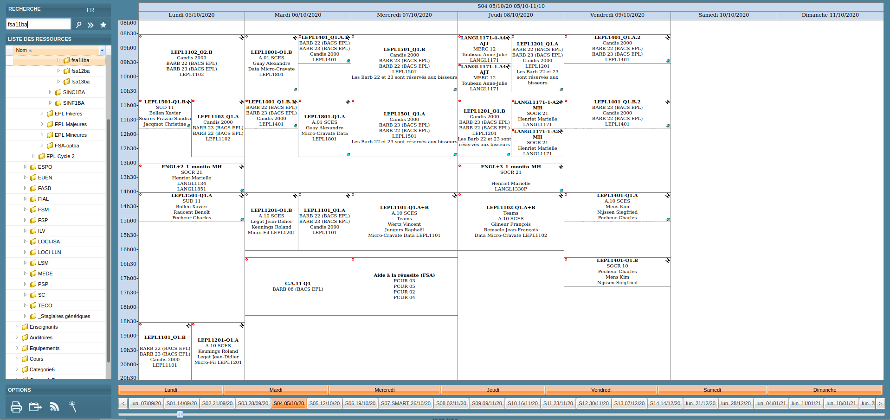

   </img>

    

# ADE Scheduler: a scheduling tool made for humans

[ADE-Scheduler](https://ade-scheduler.info.ucl.ac.be/) is a web-application made by (former) students which is destined to be used by UCLouvain members (students, academics,...).

### Project creators

- [Eertmans Jérome](https://www.linkedin.com/in/j%C3%A9rome-eertmans-130ab1130/) (active maintainer)
- [Navarre Louis](https://www.linkedin.com/in/louis-navarre-36b78b143/)
- [Poncelet Gilles](https://www.linkedin.com/in/gilles-poncelet-020442195/) (active maintainer)

We are three former students from the Ecole Polytechnique de Louvain (EPL) and were starting our first master year at the start of the project.

### Why such a tool ?

The currently used scheduling tool used by the UCLouvain, [ADE](http://horaire.uclouvain.be/direct/), lacks an intuitive interface and general usability. Therefore, we decided to create ADE-Scheduler as a "wrapper" around this tool to make it more intuitive, nice and complete.

Before that, we were using the excellent [ADE2ICS](https://github.com/cdamman/UCL2ICS) made by Corentin Damman which allowed to create subscription links where one could select its events (TPs, CMs, etc). ADE-Scheduler is therefore an improvement of this tool.

### Key dates

- **August 2019** : start of the project
- **September 2019** : access to the API of ADE and release of the first version of the tool
- **Summer 2020**: complete overhaul of the tool to make it more attractive, intuitive and mobile-friendly.
- **September 2020**: release of the second version of the tool
- **September 2021**: 2 years of service, Python 3.9 upgrade and 3500+ users
- **December 2021**: 7000+ users
- **January 2022**: Moving auth. system to UCLouvain OAuth, thereby resetting the number of users to 0 on January 29nth, 2022

### How does it work ?

#### Back-end </img>

##### Data source

Thanks to the access to the API of ADE, we obtain all the information in a `XML` format. Those are up-to-date with the infos you will find on the ADE website. We are mainly interested in two type of informations:

- Event list sorted by course
- Location of every UCLouvain classroom, auditorium, etc.

#### Data treatment

The backend of ADE-Scheduler is written in Python using the [Flask](https://flask.palletsprojects.com/en/1.1.x/) micro-framework. Other packages are also used to supply many useful functions to enhance the overall user experience.\
Among those, we use [pandas](https://pandas.pydata.org/) pandas to optimise the performances, [ics](https://pypi.org/project/ics/) to convert the schedules in the iCal format - and many more.

We also use a [Redis](https://redis.io) server to store user sessions and buffer data, as well as a [PostgreSQL](https://www.postgresql.org/) database to store user accounts and schedules.

### Front-end </img> </img>

Client-side logic is handled using [Vue](https://vuejs.org/), a JavaScript reactive framework. Moreover, the events are displayed on a calendar generated with the help of the [FullCalendar](https://fullcalendar.io) package.

The UI is made mainly with the help of [Bootstrap](https://getbootstrap.com/), which handles all the CSS and makes the website enjoyable and mobile-friendly.

### Functionalities and comparison with ADE

In short, ADE Scheduler offers the same information as ADE, but in a much
more elegant manner. A side by side comparison of the two sites just
speaks for itself:

But an intuitive design is not the only advantage of ADE Scheduler, it also
comes with several useful tools which ADE does not have:

- [x] black-listing some events in order to have a clean schedule
- [x] easily viewing multiple courses
- [x] handling multiple schedules
- [x] computing your optimized schedule which minimizes conflicts
- [x] adding private events
- [x] no connection required
- [x] caching of you data so you don't lose everything each time you leave
- [x] detailed map of classrooms and events associated
- [x] possibility to download schedule to iCal file or create subscription link
- [x] you can share you calendar with anyone you would like

... and many more !

### Documentation

The website's documentation is available on the [help page](https://ade-scheduler.info.ucl.ac.be/help).

### Future improvements

Here are listed a series of issues we would like to implement in the future:

- Implement a complete testing suite to enable easy and robust CI
- Complete the help section with more videos, tips, etc.

We are open to any suggestions !

## Contributing

This application being open source, everyone is more than welcome to contribute in any way !
To see more details about our contributing guidelines, please refer to [contributing](/CONTRIBUTING.md).

Any suggestion, idea or bugs are much appreciated, and you can contact us at all times either by [mail](mailto:adescheduler@gmail.com) or directly on this repository.
