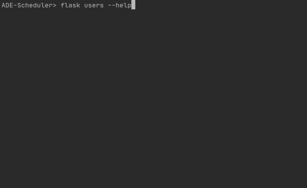

command-line tools
==================

Here are listed the different command-line tools which can be used directly in a command shell.
**Warning**: only the commands we have created are documented here, but many more
exist !

Documentation is generated using sphinx-click but does not offer a pretty rendering.
For a more detailed documentation, please use :code:`flask --help` directly in the
command shell.

.. toctree::
   :maxdepth: 1

   cli_api_usage
   cli_client
   cli_external_calendars
   cli_mails
   cli_plots
   cli_redis
   cli_roles
   cli_schedules
   cli_sql
   cli_usage
   cli_users
