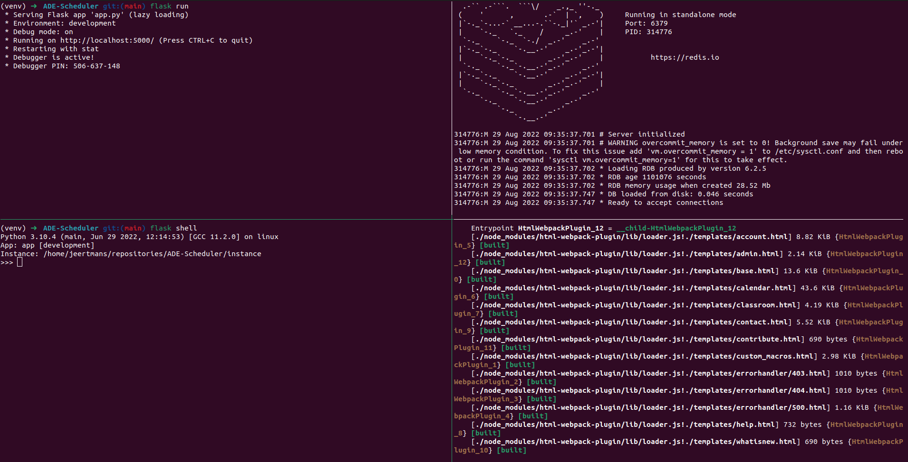

.. launch tutorial

===============
Launch tutorial
===============

.. launch info begin

Almost there ! Once you proceeded to the above installation steps, you can now
run the following command in your terminal to run the project. Make sure that
you are still within the virtual environment.

.. code-block:: console

    $ flask run

.. note::

    It is recommended to copy the above command lines (i.e., virtual environment activation,
    database initialization, redis-server startup, flask launch) in an executable script
    in order to facilitate the project launch for the next times. You can check the
    'docker/entrypoint.sh' file for some inspiration.

Your terminal should now display a page url that you can access with your browser. This
is your local version of the app!

   Example of terminal configuration when everything is running properly. Here, you can see four terminal sessions: flask server (upper left), redis server (upper right), flask shell (lower left), and webpack (lower right). The "(venv)" indicates that the virtual environment is activated (required for left terminals only).

.. launch info end

.. contents:: Table of content
